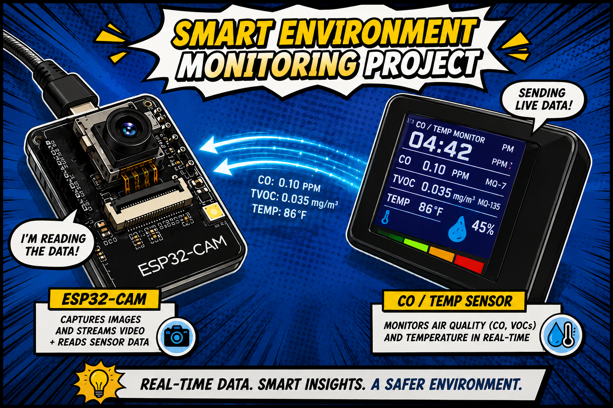
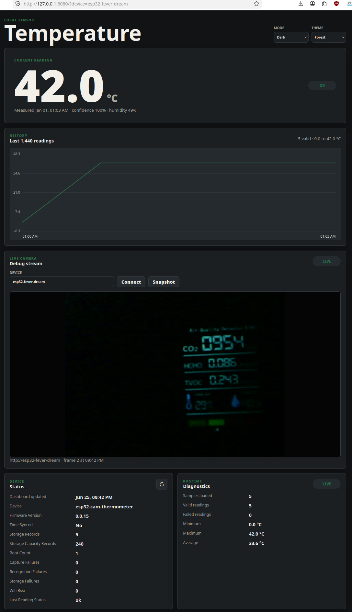

# ESP32 Fever Dream

Local ESP32-CAM air quality sensor readout firmware. The current prototype captures an AQS display every 10 seconds, recognizes CO2, HCHO, TVOC, temperature, and humidity, stores readings in bounded local storage, and serves a dashboard plus raw API endpoints directly from the ESP32.

**Status: mounted AQS TinyML prototype.** The ESP32-CAM joins the configured Wi-Fi, captures the fixed display every 10 seconds, runs an embedded int8 TFLite digit classifier, stores recent records in RAM, and serves the dashboard and API directly from the device. The current firmware has five-value AQS plumbing for `CO2`, `HCHO`, `TVOC`, temperature, and humidity; CO2/HCHO/TVOC OCR boxes are provisional and need fresh labeled captures before the values are production-trustworthy. The attached camera currently detects as OV2640, which is fixed-focus; OV5640 autofocus support is compiled in and starts automatically only when an AF-capable OV5640 module is detected.

**Author: Marcel Petrick <mail@marcelpetrick.it>**

**Note: projected is generated with AI.**

**License: GPLv3 or later. See `LICENSE`.**

### set-up idealized


### web-UI-view


## Current Web UI

The static dashboard lives in `web/` and is embedded into the firmware image.
Open the device directly after it joins Wi-Fi:

```text
http://esp32-fever-dream/
```

It expects:

```text
GET /api/v1/status
GET /api/v1/current
GET /api/v1/readings/latest?count=1440
```

It renders the current CO2, HCHO, TVOC, temperature, humidity, OCR confidence,
device diagnostics, API state, firmware version, five-stage live measurement
progress, and per-metric history charts. No external CDN or internet dependency
is used.

For frontend-only development, it can also be served from the workstation and
pointed at the device:

```bash
python3 -m http.server 8080 --bind 127.0.0.1 --directory web
```

Open:

```text
http://127.0.0.1:8080/?device=esp32-fever-dream
```

## Hardware

Target hardware is borrowed from the existing ESP32-CAM notes in `/home/mpetrick/repos/esp32Collection/esp32cam/`.

| Component | Details |
| --- | --- |
| Module | AI-Thinker ESP32-CAM |
| Programmer | ESP32-CAM-MB with CH340 USB-serial |
| Camera | Current module detects as OV2640; firmware also supports OV5640 autofocus when an AF-capable OV5640 module is attached |
| Chip | ESP32-D0WDQ6 rev 1.0, dual core, 240 MHz |
| Flash | 4 MB Winbond, 3.3 V |
| Serial port | `/dev/ttyUSB0` |

The firmware configuration includes the AI-Thinker camera pin map and assumes PSRAM is available.

## Toolchain

Firmware target:

- ESP-IDF v6.0.1.
- ESP32 target.
- C++ firmware core with ESP-IDF app entrypoint.
- Managed component: `espressif/esp32-camera` pinned to `2.1.7`.
- Managed component: `espressif/esp-tflite-micro` pinned to `1.3.7`.

Host/local checks:

- CMake and Ninja.
- clang-format.
- clang-tidy.
- cppcheck.
- Doxygen.
- shellcheck.
- Node.js for JavaScript syntax checks.
- Python 3 plus ruff and black for tooling checks.

## Local Pipeline

```bash
./scripts/check_all.sh
```

Stages:

1. clang-format check.
2. Host CMake configure.
3. Host C++ build.
4. Host unit tests.
5. shellcheck, cppcheck, and clang-tidy when available.
6. ESP-IDF firmware build for `esp32`.
7. Static web asset syntax check.
8. Python compile, ruff, and black checks when available.
9. Doxygen generation with warnings treated as errors.

The pipeline is intended to run without attached hardware. It builds the firmware image locally but does not flash the board.

## Build Firmware

ESP-IDF is not vendored. The scripts source the pinned local install automatically when `idf.py` is not already on `PATH`:

```bash
./scripts/build_firmware.sh
```

Default local install path:

```text
~/.local/opt/esp-idf-v6.0.1
```

Override it with `IDF_PATH_ROOT=/path/to/esp-idf-v6.0.1 ./scripts/build_firmware.sh`. If the export script is not available, the firmware build exits with a clear error.

## Local Configuration

Wi-Fi credentials must stay out of Git.

Create ignored `wifi.env` in the repository root:

```text
ssid: your-local-ssid
pw: your-local-password
```

Then build or flash normally:

```bash
./scripts/build_firmware.sh
```

`scripts/generate_wifi_config.sh` reads ignored `wifi.env` and writes ignored `main/config.local.h` for the ESP-IDF build. The firmware connects as a Wi-Fi station and logs the assigned IP address on serial.

For a stable address, prefer a DHCP reservation in the router for the ESP32-CAM MAC address. That keeps the firmware simple while still giving the device the same IP on every boot.

## Flash And Monitor

```bash
./scripts/flash_device.sh /dev/ttyUSB0
./scripts/monitor_serial.sh /dev/ttyUSB0
```

Boot mode on the ESP32-CAM-MB board:

1. Press and hold **BOOT**.
2. Press and release **RST**.
3. Release **BOOT**.
4. Run the flash command within roughly one second.

## Dataset Capture

After flashing, configure `main/config.local.h` with Wi-Fi credentials and read the device IP from serial logs. The prototype debug endpoint serves one JPEG per request:

```text
GET /debug/capture.jpg
```

Capture a local training batch from the workstation:

```bash
./scripts/collect_dataset.sh \
  --base-url http://DEVICE_IP \
  --count 100 \
  --lighting-label bright-room
```

Repeat with different `--lighting-label` values and optional camera controls such as `--brightness`, `--contrast`, `--saturation`, `--aec`, `--agc`, and `--awb`. Captures and manifests are written under ignored `tools/dataset/captures/` directories.

When Wi-Fi is unavailable, use the USB serial fallback. The firmware listens
for a `CAPTURE_JPEG` command on the serial console and returns a base64 JPEG
between explicit markers:

```bash
./scripts/collect_serial_dataset.sh \
  --port /dev/ttyUSB0 \
  --count 30 \
  --lighting-label usb-fallback \
  --framesize vga \
  --quality 12 \
  --startup-wait 10
```

This writes JPEGs and a `manifest.csv` under an ignored
`tools/dataset/captures/serial_<timestamp>/` directory.

For the current mounted air-quality display, the best measured first-pass
settings are:

```sh
./scripts/collect_dataset.sh \
  --base-url http://esp32-fever-dream \
  --count 100 \
  --interval 1 \
  --lighting-label baseline_manual_bright \
  --framesize vga \
  --quality 12 \
  --brightness 2 \
  --contrast 2 \
  --awb 0 \
  --aec 0 \
  --agc 0
```

## Project Structure

```text
esp32-fever-dream/
├── CMakeLists.txt              # ESP-IDF project or host test project
├── VERSION                     # SemVer source of truth
├── LICENSE                     # GPLv3
├── dependencies.lock           # Pinned ESP-IDF managed component resolution
├── documents/
│   ├── 00_VISION.md
│   ├── 01_PLAN.md
│   ├── 02_ML_OCR.md
│   ├── 03_currentState.md
│   ├── 04_TFLITE_TRAIN_DEPLOY_PLAN.md
│   ├── 05_ARCHITECTURE.md
│   └── 06_AQS_FIVE_VALUE_PLAN.md
├── firmware/
│   ├── include/                # Host-testable firmware interfaces
│   └── src/                    # Host-testable firmware core
├── main/
│   ├── app_main.cpp            # ESP-IDF app entry
│   ├── CMakeLists.txt
│   ├── config.example.h        # Copy to ignored config.local.h
│   └── idf_component.yml       # Pinned ESP-IDF component deps
├── web/
│   ├── index.html
│   ├── styles.css
│   └── app.js
├── tests/                      # Host unit tests
├── scripts/                    # Local pipeline, build, flash, dataset hooks
└── reports/                    # Review, model, and static analysis notes
```

## Implemented Core Modules

- `ReadingRecord`: compact five-value AQS success/failure record model with explicit status codes.
- `StorageRingBuffer`: host-tested bounded in-memory ring buffer prototype.
- `Recognition`: seven-segment digit primitive and display text validation.
- `ImagePreprocessor`: grayscale ROI validation, crop, and threshold helpers.
- `Diagnostics`: boot, failure, Wi-Fi, and time state snapshot.
- `TimeManager`: synchronized and estimated timestamp state.
- `ApiSerializer`: JSON serialization for status, current reading, historical readings, and errors.
- `TinyMlDisplayRecognizer`: ESP-only JPEG decode, fixed ROI preprocessing, and TFLite Micro digit inference for CO2, HCHO, TVOC, temperature, and humidity.

## Versioning

`VERSION` is the single source of truth. Firmware and host builds read it at configure time and expose it through:

```cpp
fever::version::ProjectVersion()
```

The project starts at `0.0.0`. Per the project rule, later implementation commits should increment the patch version by one unless directed otherwise.

## Current Limitations

- Production HTTP handlers are not wired yet; serializers and web UI define the contract first.
- Ring-buffer persistence to flash is not implemented yet.
- Recognition has primitives and validation, but no real thermometer dataset yet.

## License

GPLv3. See `LICENSE`.
