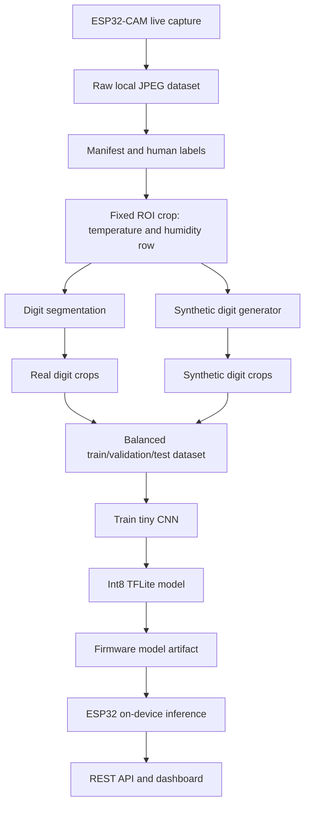
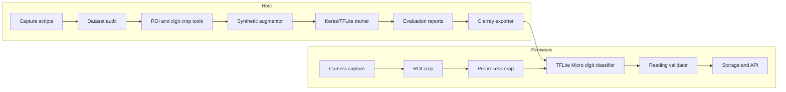

# TFLite Training And Deployment Plan

## Approval Status

Status: pending approval.

This document is the proposed plan for the next loop. Do not execute the image
capture, synthetic data generation, TFLite training, firmware integration, or
deployment steps until the plan is approved.

## Goal

Create a tiny on-device model that helps extract the displayed temperature and
humidity from the fixed ESP32-CAM view of the air-quality monitor.

The target values are:

- Temperature in Celsius.
- Humidity percent.

The current live reading is confirmed as approximately:

- `29C`
- `43%`

## Current Constraint

The current real dataset is not enough for a valid TinyML model:

- 100 usable captures.
- One distinct reading: `29C 43%`.
- Present digit classes: `2`, `3`, `4`, `9`.
- Missing digit classes: `0`, `1`, `5`, `6`, `7`, `8`.

A model trained only on this data would learn a constant answer. That would be
wrong, even if benchmark accuracy looked high on the duplicated batch.

## Strategy

Use a hybrid model:

1. Real ESP32 images define geometry, lighting, camera noise, blur, and display
   style.
2. Fixed ROI cropping locates the bottom temperature and humidity display.
3. Synthetic digit generation fills missing digit classes using the observed
   display style.
4. A tiny digit classifier learns per-digit crops, not whole-frame OCR.
5. Classical postprocessing assembles the recognized digits into temperature and
   humidity values.
6. On-device inference runs only on small grayscale digit crops.

This keeps the model small and avoids a full-frame OCR network.

## Data Flow



## Architecture



## Proposed Execution Phases

### Phase 1: More Real Captures

Capture more real images, but avoid many duplicate frames of the same value.

Proposed first capture:

- 30 to 50 images now at the confirmed `29C 43%` state.
- Use tuned camera settings:
  - `framesize=vga`
  - `quality=12`
  - `brightness=2`
  - `contrast=2`
  - `awb=0`
  - `aec=0`
  - `agc=0`

Then collect small batches when values change:

- 10 to 25 images per changed temperature/humidity state.
- Stop once a batch has enough stable examples.
- Do not capture hundreds of near-identical images unless needed for stability
  testing.

### Phase 2: Dataset Audit And Labeling

Extend the existing audit so it tracks:

- Temperature digit coverage.
- Humidity digit coverage.
- Full-reading diversity.
- Train/validation/test split by capture batch.
- Real versus synthetic sample counts.
- Negative examples.

The audit should keep blocking training until real data plus approved synthetic
data can exercise all required classes.

### Phase 3: Synthetic Data Generation

Generate synthetic digit crops from the real display style.

Use real images to learn:

- Digit crop size.
- Foreground color.
- Background color.
- Blur level.
- JPEG noise.
- Slight position jitter.
- Brightness/contrast variation.

Synthetic generation options:

1. Cut-and-paste from real digit crops when available.
2. Segment-style digit renderer for missing classes.
3. Blend generated digits into real bottom-row backgrounds.
4. Apply camera-like augmentations:
   - blur
   - brightness shifts
   - contrast shifts
   - JPEG compression
   - subpixel translation
   - mild perspective/skew

Synthetic data must be capped and tracked. It should fill missing classes, not
replace real validation data.

### Phase 4: Train Tiny Digit Classifier

Train a small classifier locally.

Candidate model:

- Input: grayscale `24x32` digit crop.
- Classes: `0` through `9`, plus `blank` and `invalid` if needed.
- Architecture:
  - Conv2D 8 filters
  - MaxPool
  - Conv2D 16 filters
  - MaxPool
  - Dense 32
  - Dense class output
- Quantization: full int8.
- Target model size: under 50 KB.
- Maximum model size: 150 KB.

Training outputs:

```text
models/generated/digit_classifier.tflite
models/generated/digit_classifier_int8.tflite
reports/model_training_audit.md
reports/model_eval.md
reports/confusion_matrix.csv
```

### Phase 5: Firmware Integration

Add TFLite Micro only after the host model proves useful.

Firmware integration:

1. Add pinned `esp-tflite-micro` dependency or a minimal compatible TFLite Micro
   integration.
2. Export the int8 model as firmware C data.
3. Add a digit classifier wrapper.
4. Add fixed ROI/digit crop preprocessing.
5. Assemble temperature and humidity readings.
6. Validate plausible ranges and confidence.
7. Store result and expose it through API endpoints.

### Phase 6: Browser Validation

Extend the current local dashboard:

- Keep live JPEG stream visible.
- Show latest recognized temperature and humidity.
- Show confidence and failure reason.
- Show last inference time.
- Show whether result came from rule-based logic, TinyML, or fallback.

## Acceptance Criteria

Do not deploy model inference as the primary reading path until:

- Full-reading exact accuracy is at least 98% on held-out real images.
- Per-digit accuracy is at least 99%.
- False accepts are explicitly measured.
- Invalid/ambiguous images are rejected instead of guessed.
- One capture plus inference fits inside one minute.
- Firmware build size and RAM usage stay within ESP32 limits.

## Approval Checklist

Before execution, approve or adjust these choices:

- Capture 30 to 50 more images now at `29C 43%`.
- Use synthetic data only for training, not for final held-out validation.
- Train a per-digit model instead of a whole-frame OCR model.
- Use `24x32` grayscale digit crops as the first input size.
- Add TFLite Micro only after host-side model evaluation passes.

## Proposed First Command After Approval

```sh
./scripts/collect_dataset.sh \
  --base-url http://esp32-fever-dream \
  --count 40 \
  --interval 1 \
  --lighting-label baseline_manual_29c_43h \
  --framesize vga \
  --quality 12 \
  --brightness 2 \
  --contrast 2 \
  --awb 0 \
  --aec 0 \
  --agc 0
```

After that capture, label the batch and rerun:

```sh
./scripts/train_model.sh --labels <new-labels.csv>
```

The training command should still block until the combined dataset has enough
real and synthetic coverage.
