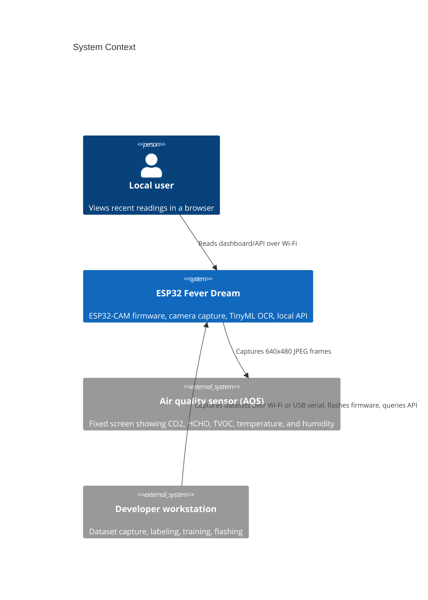
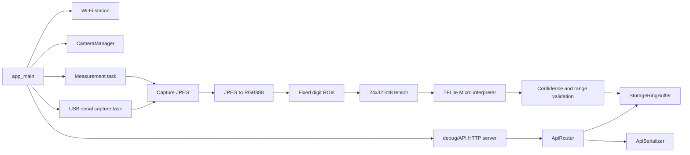
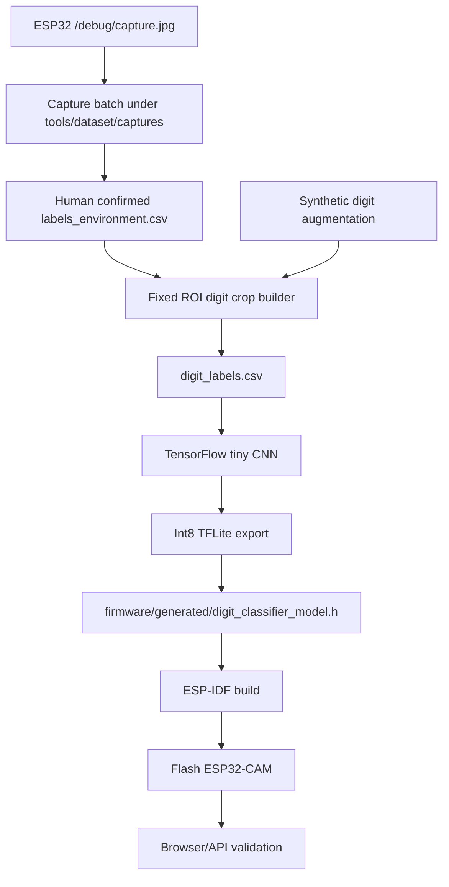
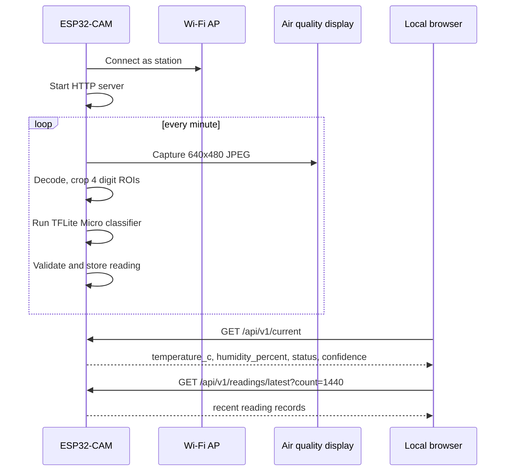

# ESP32-CAM App And Training Architecture

This document describes the current end-to-end prototype: ESP32-CAM capture,
on-device TinyML digit recognition, local storage, HTTP API output, and the host
training loop.

## Current Prototype State

- Device hostname: `esp32-fever-dream`.
- Browser/API base URL: `http://esp32-fever-dream`.
- A mounted reading was validated during deployment (`29.00 C`, `41%`), but the
  final post-flash check ended in `confidence_too_low`; OCR is integrated but
  not stable yet.
- Recognition interval: one automatic sample per minute after boot.
- The TFLite model is an int8 digit classifier embedded as
  `firmware/generated/digit_classifier_model.h`.
- The mounted prototype includes temporary corrections for observed
  mounted-display misreads around `29C / 41%` and `27C / 41%`.
- The mounted prototype confidence threshold is currently relaxed to 60%.
- The model is useful for integration testing. It is not production-ready across
  the current mounted setup, arbitrary camera shifts, display values, or bad
  lighting.

## C4 Context



## C4 Containers

```mermaid
C4Container
    title Containers
    Person(user, "Local user")
    System_Boundary(system, "ESP32 Fever Dream") {
        Container(firmware, "ESP32 firmware", "C++ / ESP-IDF", "Wi-Fi station, camera driver, measurement loop, TFLite Micro OCR")
        Container(api, "HTTP API", "esp_http_server", "Health, capture, status, current reading, recent readings")
        Container(serial, "USB serial fallback", "UART console", "No-Wi-Fi JPEG capture for datasets")
        Container(web, "Static dashboard", "HTML/CSS/JS", "Browser UI served locally during development")
        Container(storage, "Reading ring buffer", "RAM", "Last 240 records")
    }
    Container(training, "Training pipeline", "Python / TensorFlow", "Builds int8 digit model and firmware header")

    Rel(user, web, "Views")
    Rel(web, api, "GET /api/v1/*")
    Rel(firmware, storage, "Appends records")
    Rel(api, storage, "Serializes records")
    Rel(training, firmware, "Exports generated model header")
    Rel(workstation, serial, "CAPTURE_JPEG command")
```

## Firmware Components



## Training Flow



## Runtime Sequence



## Acceptance Notes

The current deployment is a working mounted prototype, not a finished OCR
product. Production acceptance needs:

- More real labels covering all digits in both temperature and humidity fields.
- Firmware-side crop debug output or telemetry so host and device preprocessing
  can be compared byte-for-byte.
- Removal of the temporary mounted-display corrections.
- Restoration of a stricter recognition threshold after real validation.
- Held-out real-frame validation across daylight, dim light, glare, and small
  camera shifts.
