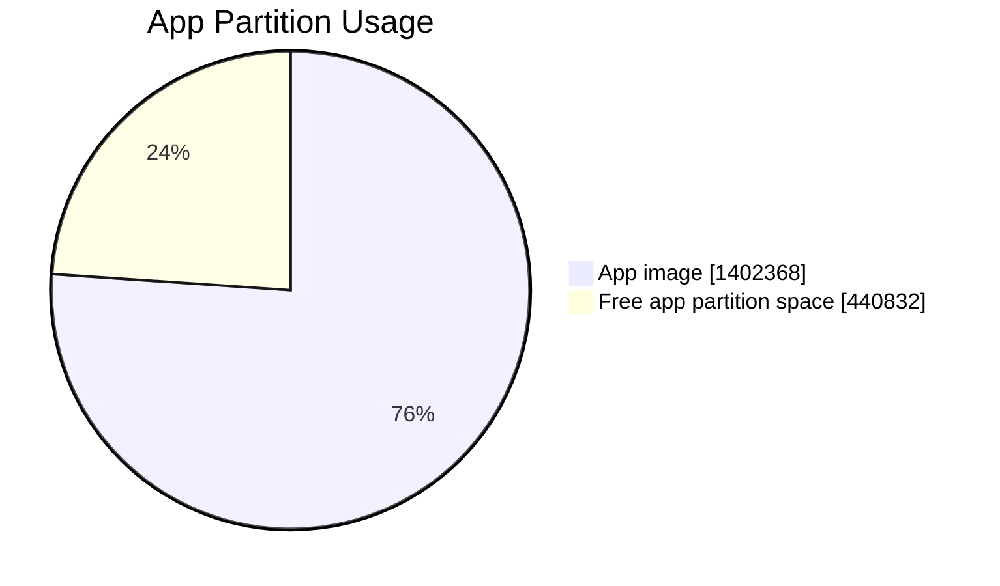
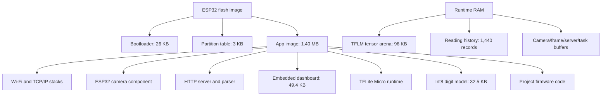

# Firmware Size Breakdown

Last measured: 2026-06-27 from ESP-IDF build output for firmware `0.0.23`,
including the dashboard embedded in flash.

## Exact Flash Artifacts

These are file sizes from the build outputs that are flashed to the ESP32-CAM.

| Artifact | Flash offset | Size | Notes |
| --- | ---: | ---: | --- |
| Bootloader | `0x1000` | `26,128 B` (`0x6610`) | Bootloader partition has `2,544 B` free. |
| Partition table | `0x8000` | `3,072 B` | Standard partition-table binary. |
| App firmware | `0x10000` | `1,402,368 B` (`0x156600`) | Smallest app partition is `1,843,200 B` (`0x1c2000`). |
| App partition free | n/a | `440,832 B` (`0x6ba00`) | About `24%` free. |



## Embedded Dashboard

The firmware build embeds the source files directly and serves them at `/`,
`/styles.css`, and `/app.js`.

| Asset | Embedded bytes |
| --- | ---: |
| `web/index.html` | `7,154 B` |
| `web/styles.css` | `8,282 B` |
| `web/app.js` | `33,928 B` |
| **Total web payload** | **`49,364 B`** |

The complete app image is `51,040 B` larger than firmware `0.0.21`; that delta
includes the web payload, HTTP handlers, pipeline telemetry, and alignment.

## Model Artifact

| Artifact | Size | Meaning |
| --- | ---: | --- |
| `models/generated/digit_classifier_int8.tflite` | `32,528 B` | Quantized int8 TFLite model. |
| `firmware/generated/digit_classifier_model.h` | `206,265 B` | C++ source representation of the model bytes. |
| `kDigitClassifierModelSize` | `32,528 B` | Actual model byte array embedded in firmware flash data. |

The model is about `2.41%` of the app image and about `1.76%` of the whole app
partition. The header file is much larger than the model because each byte is
written as C++ source text; the compiled firmware stores the binary array.

## Component-Level ELF Contributions

The following numbers come from:

```sh
python -m esp_idf_size --format csv --archives build/esp32_fever_dream.map
```

They are linker/ELF contributions, not standalone flash partitions. They are
useful for understanding what code and data dominate the app image.

| Component archive | Total | Flash code | Flash data | DRAM | Notes |
| --- | ---: | ---: | ---: | ---: | --- |
| `libnet80211.a` | `156,714 B` | `128,284 B` | `13,555 B` | `9,497 B` | Wi-Fi stack internals. |
| `libstdc++.a` | `151,561 B` | `134,476 B` | `12,608 B` | `4,477 B` | C++ standard library support. |
| `libmain.a` | `146,817 B` | `15,173 B` | `33,212 B` | `98,432 B` | Project app code plus tensor arena/model data. |
| `liblwip.a` | `103,105 B` | `96,757 B` | `3,866 B` | `2,482 B` | TCP/IP stack. |
| `libesp_stdio.a` | `99,339 B` | `404 B` | `98,919 B` | `16 B` | stdio formatting/data. |
| `libwpa_supplicant.a` | `85,627 B` | `82,433 B` | `1,856 B` | `1,338 B` | Wi-Fi security. |
| `libmbed-builtin.a` | `79,122 B` | `63,688 B` | `15,330 B` | `104 B` | Crypto/TLS primitives pulled by IDF. |
| `libespressif__esp32-camera.a` | `77,802 B` | `52,418 B` | `9,527 B` | `14,666 B` | OV2640 camera driver and conversion support. |
| `libpp.a` | `73,141 B` | `42,036 B` | `4,967 B` | `4,171 B` | Wi-Fi protocol processing. |
| `libespressif__esp-tflite-micro.a` | `64,617 B` | `63,205 B` | `1,372 B` | `40 B` | TFLite Micro runtime and kernels. |
| `libhttp_parser.a` | `15,484 B` | `14,732 B` | `752 B` | `0 B` | HTTP parser used by the server. |
| `libesp_http_server.a` | `11,191 B` | `10,852 B` | `339 B` | `0 B` | ESP-IDF HTTP server. |
| `libespressif__esp_jpeg.a` | `1,116 B` | `1,047 B` | `69 B` | `0 B` | JPEG helper component linked by the app. |

## Project Object Highlights

The most important project object is `tinyml_display_recognizer.cpp.obj`:

| Object | Total | DRAM | Flash code | Flash data | Notes |
| --- | ---: | ---: | ---: | ---: | --- |
| `tinyml_display_recognizer.cpp.obj` | `133,254 B` | `98,304 B` | `2,302 B` | `32,648 B` | Tensor arena plus model byte array and recognizer code. |
| `debug_capture_server.cpp.obj` | `4,601 B` | `12 B` | `4,109 B` | `480 B` | Debug JPEG and API HTTP glue. |
| `app_main.cpp.obj` | `2,144 B` | `116 B` | `2,024 B` | `4 B` | Boot wiring and measurement task setup. |
| `api_router.cpp.obj` | `1,604 B` | `0 B` | `1,524 B` | `80 B` | REST route selection. |
| `api_serializer.cpp.obj` | `1,400 B` | `0 B` | `1,400 B` | `0 B` | JSON serialization. |

The `98,304 B` DRAM in `tinyml_display_recognizer.cpp.obj` is the TensorFlow
Lite Micro tensor arena:

```cpp
constexpr std::size_t kTensorArenaSize = 96U * 1024U;
```

This arena is RAM, not flash. It is still important because it is the main
runtime memory cost of on-device OCR.

## Runtime Stack Shape



## What Can Be Optimized

- Model size is not the dominant flash cost right now. It is only about 32.5 KB.
- TFLite Micro runtime is about 64.6 KB of ELF contribution.
- Wi-Fi, TCP/IP, C++ runtime, and camera support dominate flash usage.
- The largest app-controlled RAM cost is the 96 KB tensor arena.
- The reading history is RAM-backed. At 1,440 records it keeps one day of
  one-minute samples and uses roughly 29 KiB plus vector overhead with the
  current record layout; `/api/v1/status` reports the device-side
  `storage_capacity_bytes`.
- If flash gets tight later, first check unused ESP-IDF features and C++ stdlib
  use before shrinking this tiny model.
- If RAM gets tight later, profile TFLM arena usage and reduce
  `kTensorArenaSize` only after the interpreter still allocates successfully.
