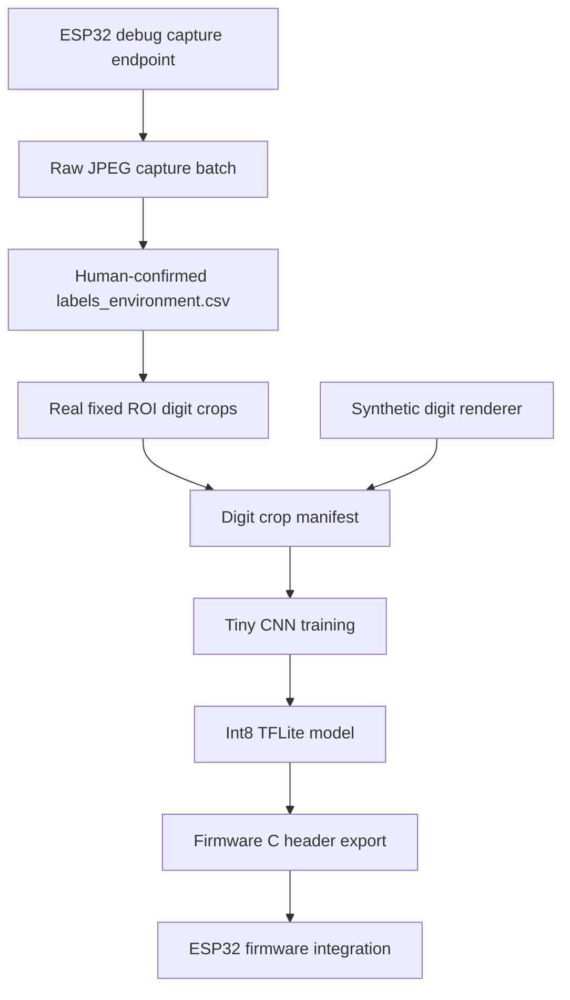
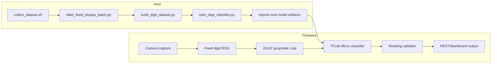

# TinyML Digit Classifier Training

This pipeline trains the fixed-display digit classifier used by the ESP32-CAM
OCR prototype. It keeps real capture validation separate from synthetic
augmentation.

## Data Flow



## Architecture



## Setup

The normal project Python is currently Python 3.14. TensorFlow wheels are not
available for that interpreter on this host, so use the dedicated ML venv:

```sh
./scripts/setup_ml_env.sh
. .venv-ml/bin/activate
```

## Capture And Label

Capture a small batch when the display value or lighting changes:

```sh
./scripts/collect_dataset.sh \
  --base-url http://esp32-fever-dream \
  --count 40 \
  --interval 1 \
  --lighting-label baseline_manual_29c_43h \
  --framesize vga \
  --quality 12 \
  --brightness 2 \
  --contrast 2 \
  --awb 0 \
  --aec 0 \
  --agc 0
```

After visually checking the contact sheet, label the batch:

```sh
python3 tools/dataset/label_fixed_display_batch.py \
  --dataset-dir tools/dataset/captures/<batch> \
  --temperature-c 29 \
  --humidity-percent 43 \
  --temperature-unit C
```

## Train Prototype

For the currently mounted prototype, the useful real batch is the
post-flash mounted geometry batch labeled `29C 41%`. To reproduce the deployed
prototype model, run:

```sh
./scripts/train_model.sh \
  --labels tools/dataset/captures/live_mounted_29c_41h_20260625T195058Z/labels_environment.csv \
  --allow-synthetic-prototype \
  --synthetic-per-digit 500 \
  --epochs 12
```

Outputs:

- `models/generated/digit_dataset/digit_labels.csv`
- `models/generated/digit_classifier.keras`
- `models/generated/digit_classifier_int8.tflite`
- `models/generated/digit_classifier_eval.json`
- `models/generated/confusion_matrix.csv`
- `firmware/generated/digit_classifier_model.h`

## Validation Rule

The prototype is useful for wiring and timing tests. It is not production-ready
until the held-out validation set contains diverse real display values and passes
the acceptance thresholds in `documents/04_TFLITE_TRAIN_DEPLOY_PLAN.md`.

The deployed firmware currently has a mounted-prototype correction for the
observed firmware-side humidity collapse of `41%` into nearby `1/2` classes.
Remove that correction after adding firmware-side crop telemetry and enough real
labels to validate humidity without the correction.
